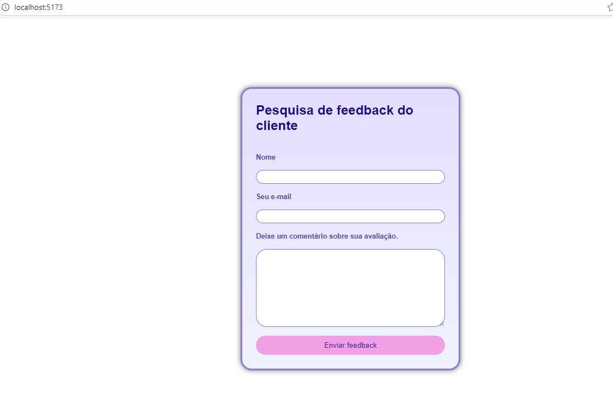

# 📋 Feedback Form em React

Projeto de formulário de feedback desenvolvido em React, com validação de campos, limpeza automática após envio e layout responsivo.

---

## 🚀 Tecnologias utilizadas

- React
- JavaScript (ES6+)
- CSS3
- HTML5

---

## 🎯 Funcionalidades

✅ Captura nome, e-mail e comentário  
✅ Validação de campos obrigatórios  
✅ Mensagem de sucesso ao enviar  
✅ Reset automático dos campos após envio  
✅ Layout responsivo  
✅ Estilização com gradiente e sombras  

---

## 🖥️ Preview

---

## 📂 Estrutura do Projeto

src/
├ assets/
├ App.jsx
├ FeedbackForm.jsx
├ App.css
└ main.jsx

## ⚙️ Como executar o projeto
📌 Pré-requisitos

- Node.js instalado
- NPM

---

1️⃣ Clonar repositório
git clone https://github.com/Monaliza-Vasconcelos/react-feedback-form.git

---

2️⃣ Entrar na pasta
cd atividade2-react

---

3️⃣ Instalar dependências
npm install

---

4️⃣ Rodar o projeto
npm run dev

---

5️⃣ Abrir no navegador
Normalmente abre em:

http://localhost:5173

---

Autora: Monaliza de Vasconcelos Coelho
